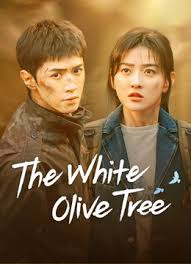

# NetFlix_Clone
## Date:10.07.2025
## Objective:
To create a modern, responsive navigation bar using CSS Flexbox, mimicking real-world websites like Netflix. This helps reinforce alignment, spacing, and layout structuring using Flexbox properties.

## Tasks:

#### 1. Structure the HTML Layout:
Use a ```<nav>``` tag as the main container.

Add a brand logo/title on the left using a ```<div> or <h1>```.

Add navigation links like Home, Menu, About, Contact, and Login using a ```<ul> with <li> and <a>```.

#### 2. Apply Flexbox for Layout:
Use display: flex on the ```<nav>``` container.

Use justify-content: space-between to align the logo and menu.

Use align-items: center to vertically center both sections.

Style list items with horizontal spacing using gap or margin.

#### 3. Style Like a Real-World Navbar:
Add background color (e.g., dark or gradient like Netflix/Zomato).

Style text with bold fonts, hover effects, and link styling.

Remove default ul and li styles (list-style: none, text-decoration: none).

#### 4. Bonus Enhancements:
Add a hover underline or button effect on links.

Make it responsive using flex-wrap or media queries.

Fix the nav bar to top with position: sticky.
## HTML Code:
```
<!DOCTYPE html>
<html lang="en">
<head>
  <meta charset="UTF-8">
  <title>Netflix - Hidden Love</title>
  <link rel="stylesheet" href="style.css">
</head>
<body>

  <div class="container">
    <div class="header">
      <div class="logo">NETFLIX</div>
      <div class="date">Monday|May|22</div>
      <div class="nav">
        <a href="#">Home</a>
        <a href="#">Movies</a>
        <a href="#">TV Shows</a>
        <a href="#">My List</a>
      </div>
      <div class="profile"></div>
    </div>

    <div class="main">
      <div class="main-content">
        
        <div class="text-content">
          <p class="tags">DOCUMENTARY | TV SHOW | KNOWLEDGE</p>
          <h1 class="title">HIDDEN LOVE</h1>
          <p class="info">2023 | DIRECTOR: XYZ STUDIOS | SEASON 1 (10 Episodes)</p>
          <p class="desc">
            This romantic drama explores the untold story of two souls destined to meet. 
            Hidden beneath the surface of everyday life, their love blossoms through secret moments, quiet confessions, and heartwarming connections.
          </p>
          <div class="buttons">
            <button class="stream">STREAM NOW</button>
            <button class="episodes">ALL EPISODES</button>
          </div>
          <div class="trailer">▶ Watch Trailer</div>
        </div>
      </div>
    </div>

    <div class="popular">
      <h3>POPULAR SHOWS THIS WEEK</h3>
      <div class="shows">
        <div class="show">
          
          <div class="show-title">When I Fly Towards You</div>
        </div>
        <div class="show">
          
          <div class="show-title">Falling Into Your Smile</div>
        </div>
        <div class="show">
          
          <div class="show-title">The White Olive Tree</div>
        </div>
         <div class="show">
          
          <div class="show-title">Love Alarm</div>
        </div>
      </div>
    </div>

    <div class="age">18+</div>
  </div>
</body>
</html>

```
## CSS Code:
```
body {
  margin: 0;
  font-family: Arial, sans-serif;
  background: #e50914;
  color: white;
}

.container {
  background: black;
  padding: 20px;
  max-width: 960px;
  margin: 40px auto;
  border-radius: 8px;
  position: relative;
}

.header {
  display: flex;
  justify-content: space-between;
  align-items: center;
  flex-wrap: wrap;
}

.logo {
  font-size: 28px;
  font-weight: bold;
  color: white;
}

.date {
  color: gray;
}

.nav a {
  margin: 0 10px;
  color: white;
  text-decoration: none;
}

.profile {
  width: 30px;
  height: 30px;
  border-radius: 50%;
  background:blue;
}

.main {
  margin-top: 40px;
}

.main-content {
  display: flex;
  gap: 20px;
  align-items: flex-start;
}

.poster {
  width: 200px;
  height: auto;
  border-radius: 10px;
}

.text-content {
  flex: 1;
}

.tags {
  color: gray;
  font-size: 14px;
}

.title {
  font-size: 50px;
  font-weight: bold;
  margin: 10px 0;
}

.info, .desc {
  color: #ccc;
  margin: 5px 0;
}

.buttons {
  margin: 20px 0;
}

button {
  padding: 10px 15px;
  margin-right: 10px;
  border: none;
  border-radius: 5px;
  cursor: pointer;
}

.stream {
  background-color: #e50914;
  color: white;
}

.episodes {
  background-color: #444;
  color: white;
}

.trailer {
  margin-top: 10px;
  font-size: 16px;
  cursor: pointer;
}

.popular {
  margin-top: 40px;
}

.shows {
  display: flex;
  gap: 15px;
  margin-top: 10px;
  flex-wrap: wrap;
  justify-content: space-between;
}

.show {
  background: #222;
  padding: 10px;
  border-radius: 5px;
  text-align: center;
  width: 180px;
}

.show img {
  width: 100%;
  height: auto;
  border-radius: 5px;
  margin-bottom: 10px;
}

.show-title {
  color: white;
  font-size: 14px;
}

.age {
  position: absolute;
  bottom: 20px;
  right: 20px;
  background: #e50914;
  padding: 5px 10px;
  border-radius: 3px;
}
```
## Output:


## Result:
A modern, responsive navigation bar using CSS Flexbox, mimicking real-world websites like Netflix. This helps reinforce alignment, spacing, and layout structuring using Flexbox properties is created successfully.
